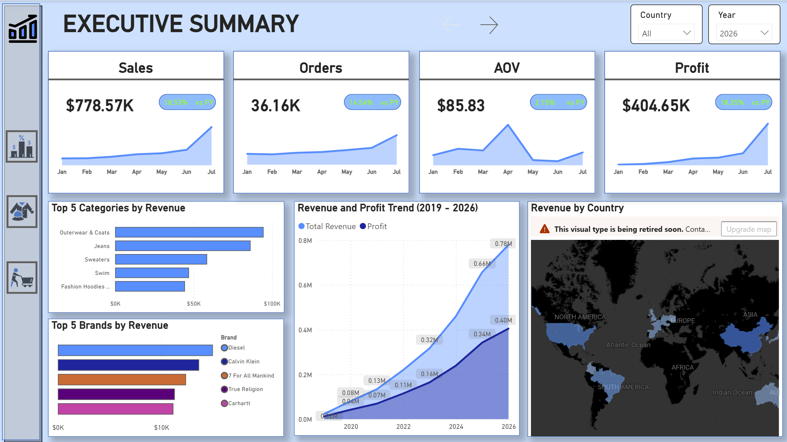
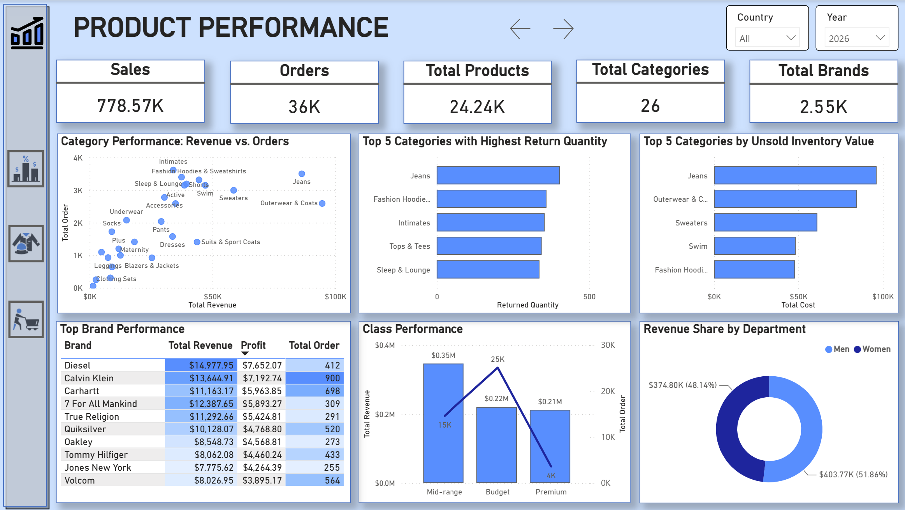
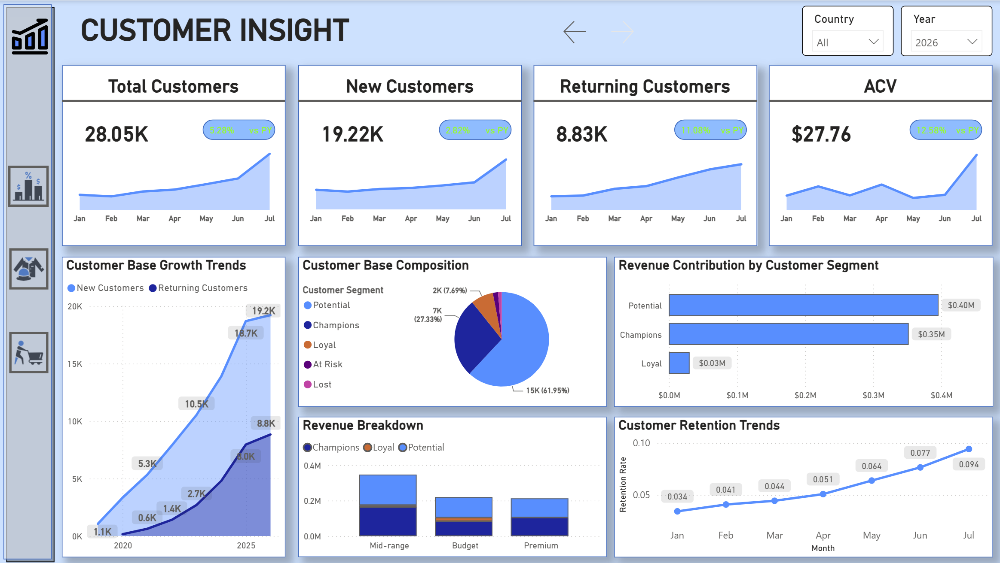

# Fashion Retail Analytics

## Project Background

This project analyzes transactional data from a fashion e-commerce company to evaluate sales performance, product contribution, and customer behavior. The dataset contains historical transaction records spanning multiple years, covering product categories, brand-level sales, inventory status, order activity, and user demographics. While the primary focus of this analysis centers on the period from January 1, 2026, to July 29, 2026, data from preceding years is actively incorporated to evaluate Year-over-Year (YoY) growth and establish long-term trends.

The analysis aims to understand the key factors influencing revenue growth and customer value, while identifying opportunities to optimize inventory management, increase average order value, and strengthen customer retention.

**Data Source:** [The Look eCommerce](/files/data)

The project focuses on three key areas:
- **Executive Summary**: Analyze revenue trends, order volume, AOV, and profitability across key global markets to identify major drivers and periods of consistent growth.
- **Product Performance**: Evaluate revenue and profit contribution across product categories, brands, and price classes. Identify high-value items, high-volume traffic drivers, and uncover supply chain bottlenecks related to high return rates and unsold inventory.
- **Customer Insight**: Analyze customer base growth and retention trends, segment customers based on their purchasing behavior, and identify actionable strategies to convert new buyers into loyal brand advocates.

The analysis leverages **Microsoft SQL Server (MS SQL)** and **Power BI** in a parallel analytical workflow. Raw data was exported from **Google BigQuery** and loaded into MS SQL for data manipulation. To ensure robust logic and data accuracy, key business metrics were calculated simultaneously using T-SQL and DAX, effectively transforming complex transactional data into actionable business insights and interactive visual storytelling.

- SQL Analysis & Metric Calculation: The T-SQL scripts used for data preprocessing, aggregation, and calculating key business metrics (such as Active Customers, Retained Customers, and MoM Growth) to validate against Power BI models can be found [here](/files/sql).
- Power BI Modeling & Visualization: The data modeling workflow, DAX measures, and interactive dashboards used to visualize business performance and customer insights can be found [here](/files/dash).

## Data Structure & Initial Checks

The initial dataset consists of five raw tables: *orders*, *order_items*, *users*, *products*, and *inventory_items*, with the primary orders table containing **124,819** transaction records.

Before analysis, the data structure and potential relationships between the tables were reviewed, and initial data quality checks were performed using **Microsoft SQL Server** and **Power Query**. These checks covered missing values, duplicate records, inconsistent data formats, and potential data integrity issues across the transactional and dimensional data.

A key data modeling step involved structuring these raw tables into a robust relational model. Because the transactional data is normalized, *order_items* acts as a bridge connecting the orders with the *products* and *inventory_items* dimensions.

To enhance the analytical capabilities of the model, two additional calculated tables were generated directly within **Power BI**:

- *Date* Table: A centralized dimension table created to enable consistent time-intelligence analysis across all temporal fields in the dataset.
- *RFM* Table: Calculated using DAX, this table derives Recency, Frequency, and Monetary metrics for each user to segment the customer base and drive deeper Customer Insights.

The resulting data model structure and the active relationships used for data integration are illustrated below:

  

## Executive Summary

  

The first seven months of 2026 mark a period of robust and comprehensive growth for the business. A high-level view of the core Key Performance Indicators (KPIs) reveals a highly positive trend across all fronts:

- **Impressive Top-Line Growth**: Total Sales reached **$778.57K**, marking a substantial **18.53%** increase compared to the previous year (YoY). Concurrently, total order volume hit **36.16K**, reflecting a solid **14.54%** growth.
- **Optimized Profit Margin**: Total Profit stands at **$404.65K** (up **18.39%** YoY). This highlights an ideal and highly efficient gross profit margin of approximately **52%**, proving that the top-line revenue growth is not compromising bottom-line profitability.
- **Average Order Value (AOV) Dynamics**: The average customer spend per order sits at **$85.83** (a **2.15%** increase). Notably, the AOV trendline reveals a significant purchasing spike around **April**. By the end of **July**, all core metrics demonstrate a steep, upward trajectory, indicating strong mid-year momentum.
- **Flagship Categories & Brands**: Revenue is heavily driven by winter wear and denim. **Outerwear & Coats** leads the charge with nearly **$100K** in sales, closely followed by **Jeans**, **Sweaters**, **Swimwear**, and **Fashion Hoodies**. In terms of brand performance, premium and near-premium labels dominate the market, spearheaded by **Diesel**, and followed by **Calvin Klein**, **7 For All Mankind**, **True Religion**, and **Carhartt**.
- **Global Market Heatmap & Long-term Trends**: While the customer footprint spans globally, the core revenue streams remain heavily concentrated in **North America (USA)** and **Asia (China)**. Furthermore, the 2019–2026 revenue trendline confirms that the current performance is not a short-term anomaly, but part of a highly stable and sustainable upward climb year over year.

## Product Performance

  

While the **Executive Summary** paints a picture of robust top-line success driven by **winter wear** and **denim**, a deeper dive into the vast catalog of **24.24K** products, **26** categories, and **2.55K** brands reveals underlying operational bottlenecks. The data uncovers a stark contrast between high sales volume and supply chain efficiency.

- **Category Imbalance**: A scatter plot analysis confirms that **Jeans** and **Outerwear & Coats** are the indisputable *star players*, driving both top-tier revenue and high order volumes. Conversely, the **Intimates** category acts as a traffic magnet—generating a massive number of orders—but yields a disproportionately low revenue contribution.
- **The Jeans Paradox & Supply Chain Bottlenecks**: Despite being the primary revenue drivers highlighted in the overall business performance, these exact flagship categories pose the greatest operational risks. **Jeans** ranks first in Return Quantity (approaching **500** returned items), closely followed by **Fashion Hoodies** and **Intimates**. More critically, **Jeans** and **Outerwear & Coats** lead the charts for Unsold Inventory Value, tying up hundreds of thousands of dollars in capital and indicating potential issues with sizing, quality, or demand forecasting.
- **Demographics & Price Class Efficiency**: Revenue is highly balanced across genders, split almost evenly between Men (**48.14%**) and Women (**51.86%**). When analyzing price classes, the **Mid-range** segment is the core financial pillar, bringing in **$0.35M** from **15K** orders. The **Budget** class serves primarily as a loss leader or traffic generator, driving a record **25K** orders but only contributing **$0.22M**. Meanwhile, the **Premium** tier proves highly efficient, generating **$0.21M** from merely **4K** orders.
- **Brand Dynamics**: Aligning with the dominance of premium labels noted earlier, **Diesel** emerges as the most profitable brand, generating **$7.65K** in profit from just **412** orders. However, **Calvin Klein** reigns as the *traffic king*, pulling in nearly double the volume (**900** orders) and **$13.64K** in revenue, showcasing its widespread mass appeal compared to niche luxury competitors.

## Customer Insights

  

To understand who is driving the robust revenue and purchasing these specific product classes, we must look closely at the customer base. The data reveals a business in an aggressive and highly successful expansion phase, though long-term sustainability will require a strategic shift toward retention.

- **Hyper-Focus on New Acquisition**: The customer base is expanding rapidly. Out of the **28.05K** total customers (a **5.28%** increase), a staggering **19.22K** are **New Customers**, heavily outweighing the **8.83K Returning Customers**. Despite this heavy reliance on fresh traffic, the **Average Customer Value** (ACV) has grown by **12.58%** to reach **$27.76**, indicating that these new buyers are willing to spend.
- **The Potential Majority**: Segmentation analysis reveals a fascinating structural disparity. The **Potential** segment makes up the lion's share of the user base at **61.95%** (**15K users**). This group generates the highest total revenue (**$0.40M**), perfectly aligning with the high volume of **Budget** and **Mid-range** orders identified in our earlier Product Performance analysis.
- **The Purchasing Power of Champions**: The Pareto principle (80/20 rule) is visibly at play. The **Champions** segment accounts for just **27.33%** (**7K users**) of the base but contributes a massive **$0.35M** in revenue, closely trailing the much larger **Potential** group. This small but mighty cohort is heavily investing in the **Mid-range** and **Premium** classes (like **Diesel** and **Calvin Klein**), proving them to be the most profitable demographic.
- **Optimistic Retention Signals**: While the strictly **Loyal** segment is currently very thin (representing just **7.69%** of the base and **$0.03M** in revenue), the overarching **Customer Retention Trend** offers a highly promising outlook. The monthly retention rate has climbed steadily and consistently, growing from a mere **3.4%** in January to **9.4%** by **July 2026**.

## Strategic Recommendations

To synthesize the insights from the overarching narrative and resolve the identified operational bottlenecks, the business must execute three targeted strategies to optimize long-term profitability:

**1. Mitigate Supply Chain Risks in Jeans and Outerwear**
  - **Investigate Return Drivers**: Address the exceptionally high return rate in the **Jeans** category by conducting an immediate audit of sizing guides, fabric quality, and packaging standards to reduce reverse logistics costs.
  - **Liquidate Unsold Inventory**: To resolve the capital tied up in unsold **Jeans** and **Outerwear**, implement targeted clearance sales during seasonal transitions. Additionally, create strategic product bundles (e.g., pairing stagnant inventory with high-traffic **Budget** items) to rapidly move stock and free up cash flow.
**2. Restructure the Product and Marketing Mix**
  - **Leverage Loss Leaders**: Utilize high-volume, low-margin **Budget** items (such as **Intimates** and **Tops & Tees**) strategically as top-of-funnel magnets to aggressively acquire new traffic and lower **Customer Acquisition Cost**.
  - **Target Premium Audiences**: Concentrate premium marketing efforts and high-end brand promotions (e.g., **Diesel**, **Calvin Klein**) specifically on the **Champions** segment. This cohort demonstrates a high willingness to pay, ensuring maximum return on ad spend and optimal profit margins for the **Premium** and **Mid-range** classes.
**3. Shift Focus from Hunting to Nurturing**
  - **Capitalize on the Potential Base**: While the business currently excels at customer acquisition (**19.2K** new vs. **8.8K** returning), sustaining growth requires shifting focus to the massive **Potential** segment, which accounts for **61.95%** of the user base (**15K** customers).
  - **Launch Loyalty Initiatives**: Immediately deploy automated email marketing workflows, tiered loyalty programs, or point accumulation systems designed specifically to nurture and convert these **Potential** buyers into high-value **Champions**. With the retention rate already showing organic upward momentum (hitting a peak of **9.4% in July**), this is the optimal window to roll out dedicated membership policies.
