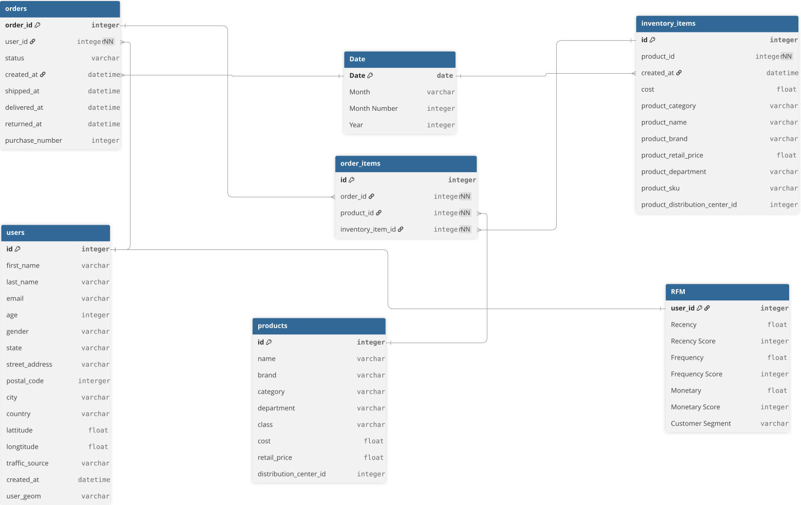

# Fashion Retail Analytics

## Project Background

This project analyzes transactional data from a fashion e-commerce company to evaluate sales performance, product contribution, and customer behavior. The dataset contains historical transaction records spanning multiple years, covering product categories, brand-level sales, inventory status, order activity, and user demographics. While the primary focus of this analysis centers on the period from January 1, 2026, to July 29, 2026, data from preceding years is actively incorporated to evaluate Year-over-Year (YoY) growth and establish long-term trends.

The analysis aims to understand the key factors influencing revenue growth and customer value, while identifying opportunities to optimize inventory management, increase average order value, and strengthen customer retention.

The project focuses on three key areas:
- **Executive Summary**: Analyze revenue trends, order volume, AOV, and profitability across key global markets to identify major drivers and periods of consistent growth.
- **Product Performance**: Evaluate revenue and profit contribution across product categories, brands, and price classes. Identify high-value items, high-volume traffic drivers, and uncover supply chain bottlenecks related to high return rates and unsold inventory.
- **Customer Insight**: Analyze customer base growth and retention trends, segment customers based on their purchasing behavior, and identify actionable strategies to convert new buyers into loyal brand advocates.

The analysis leverages **Microsoft SQL Server (MS SQL)** and **Power BI** in a parallel analytical workflow. Raw data was exported from **Google BigQuery** and loaded into MS SQL for data manipulation. To ensure robust logic and data accuracy, key business metrics were calculated simultaneously using T-SQL and DAX, effectively transforming complex transactional data into actionable business insights and interactive visual storytelling.

- SQL Analysis & Metric Calculation: The T-SQL scripts used for data preprocessing, aggregation, and calculating key business metrics (such as Active Customers, Retained Customers, and MoM Growth) to validate against Power BI models can be found here.
- Power BI Modeling & Visualization: The data modeling workflow, DAX measures, and interactive dashboards used to visualize business performance and customer insights can be found here.

## Data Structure & Initial Checks

The initial dataset consists of five raw tables: *orders*, *order_items*, *users*, *products*, and *inventory_items*, with the primary orders table containing **124,819** transaction records.

Before analysis, the data structure and potential relationships between the tables were reviewed, and initial data quality checks were performed using **Microsoft SQL Server** and **Power Query**. These checks covered missing values, duplicate records, inconsistent data formats, and potential data integrity issues across the transactional and dimensional data.

A key data modeling step involved structuring these raw tables into a robust relational model. Because the transactional data is normalized, *order_items* acts as a bridge connecting the orders with the *products* and *inventory_items* dimensions.

To enhance the analytical capabilities of the model, two additional calculated tables were generated directly within **Power BI**:

- *Date* Table: A centralized dimension table created to enable consistent time-intelligence analysis across all temporal fields in the dataset.
- *RFM* Table: Calculated using DAX, this table derives Recency, Frequency, and Monetary metrics for each user to segment the customer base and drive deeper Customer Insights.

The resulting data model structure and the active relationships used for data integration are illustrated below:

  

